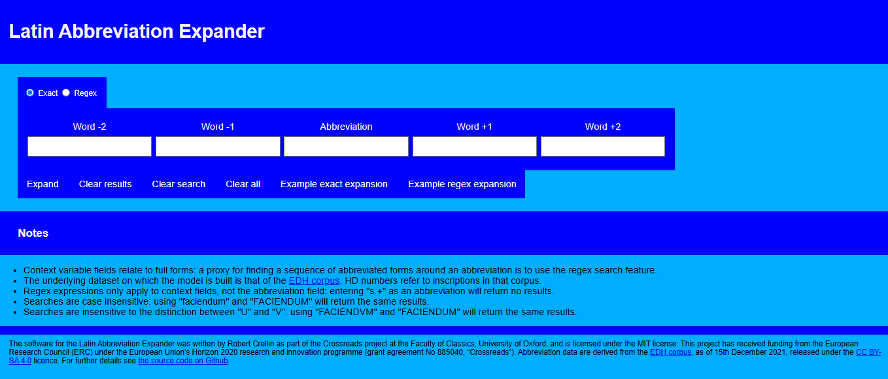

<div>
  
  
  
</div>
<br clear="all">

# Latin Abbreviation Expander

The source code for the Latin Abbreviation Expander is written in [TypeScript](https://www.typescriptlang.org/) and transpiled to JavaScript (ECMAScript 2019).



## Run on local machine

Download files and open ```index.html``` in a browser.

## Build

``` bash
# Install dev dependencies
npm install

# Transpile from TS to JS
npx tsc
```

## Acknowledgements

Latin Abbreviation Expander was written in [TypeScript](https://www.typescriptlang.org/) ([Apache 2.0](https://github.com/microsoft/TypeScript/blob/main/LICENSE.txt)) and uses danfo.js ([MIT](https://github.com/javascriptdata/danfojs/blob/dev/LICENCE)). (The licenses for `TypeScript` and `danfo.js` are included in the `LICENSES` directory.)

The software for the Latin Abbreviation Expander was written by Robert Crellin as part of the Crossreads project at the Faculty of Classics, University of Oxford, and is licensed under the MIT license. This project has received funding from the European Research Council (ERC) under the European Union’s Horizon 2020 research and innovation programme (grant agreement No 885040, “Crossreads”).

Abbreviation data, contained in the ```data/``` subfolder, are derived and transformed from the <a href="https://edh.ub.uni-heidelberg.de/" target="_blank">EDH corpus</a>, as of 15th December 2021, and are released under the  <a href="https://creativecommons.org/licenses/by-sa/4.0/deed.en" target="_blank">CC BY-SA 4.0</a> licence.

The repository as a whole is licensed under the [GNU GPL v 3 license](LICENSES/gpl-3.0.txt). My understanding is that this license is one-way compatible with the CC-BY-4.0 licence, MIT and Apache 2.0, such that it is possible for the requirements of those licenses to be fulfilled under GPL (see [https://creativecommons.org/2015/10/08/cc-by-sa-4-0-now-one-way-compatible-with-gplv3/](https://creativecommons.org/2015/10/08/cc-by-sa-4-0-now-one-way-compatible-with-gplv3/)).